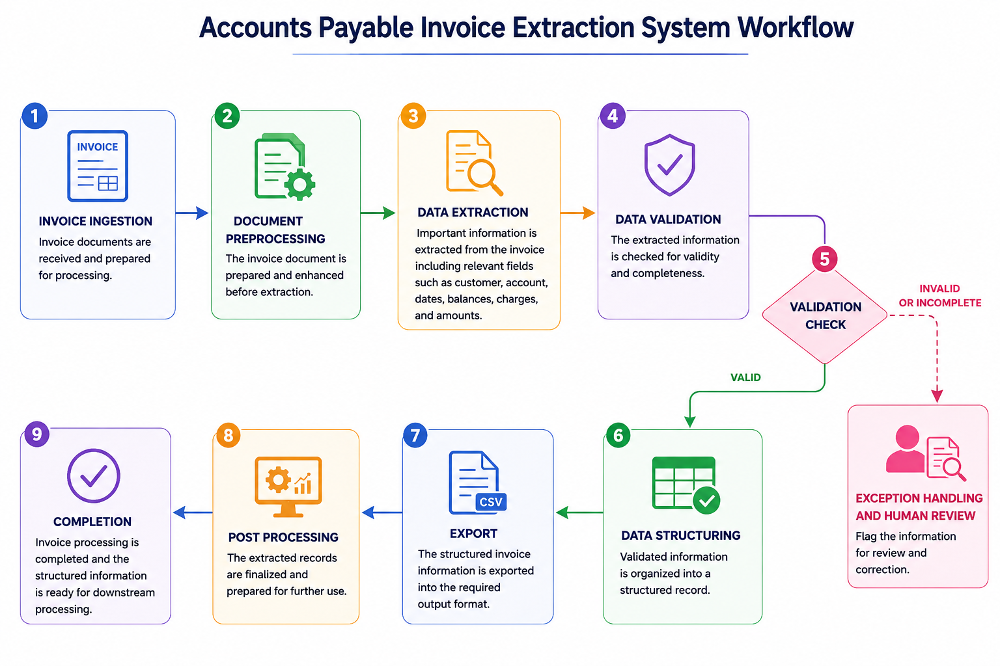

Accounts Payable Invoice Extraction
  

Overview

Accounts Payable Invoice Extraction is a document processing system designed to extract important information from invoices and convert it into structured data.

The system takes invoice documents as input, processes the document content, extracts relevant invoice fields, checks the extracted information, and produces a structured output that can be used for further accounts payable processing.

The main purpose of the project is to automate repetitive invoice data extraction and reduce the need for manual entry.

Aim
Automate invoice information extraction
Extract important fields from invoice documents
Convert unstructured invoice information into structured data
Validate extracted information
Identify incomplete or incorrect extraction results
Produce structured output for further processing
Key Features
Invoice Input — Accepts invoice documents for processing
Document Processing — Processes the invoice content before extraction
Information Extraction — Identifies and extracts relevant invoice information
Field Extraction — Extracts important details such as invoice information, customer details, dates, amounts, and charges
Data Validation — Checks extracted information for completeness and correctness
Structured Data Generation — Organizes extracted information into a consistent structure
Output Generation — Produces the extracted invoice information in a usable output format
Benefits
Reduces Manual Effort — Minimizes repetitive invoice data entry
Improves Accuracy — Reduces errors caused by manual extraction
Faster Processing — Speeds up the invoice processing workflow
Consistent Data — Produces invoice information in a standardized structure
Handles Multiple Invoices — Supports processing of invoice documents systematically
Improves Productivity — Allows accounts payable teams to spend less time on repetitive extraction tasks
Workflow

The system follows this overall process:

Invoice Document → Document Processing → Data Extraction → Data Validation → Structured Data → Output

Workflow Steps

1. Invoice Ingestion
Invoice documents are provided to the system as input.

2. Document Processing
The invoice document is processed and prepared so that its information can be analyzed.

3. Data Extraction
Relevant information is identified and extracted from the invoice, including invoice details, customer information, dates, amounts, and other required fields.

4. Data Validation
The extracted information is checked to determine whether the required data has been extracted correctly and completely.

5. Validation Decision

Valid Data: Continue to structured data generation.
Invalid or Incomplete Data: The invoice information is flagged for correction or further review.

6. Structured Data Generation
Validated invoice information is organized into a structured record.

7. Output Generation
The structured invoice information is saved as the final output for further accounts payable processing.

Use Cases
Automated invoice data entry
Accounts payable processing
Bulk invoice information extraction
Financial document processing
Invoice data digitization
Converting invoice documents into structured records
Project Goal

The goal of Accounts Payable Invoice Extraction is to transform invoice documents into accurate and structured information while minimizing manual invoice processing.

Invoice Document → Process → Extract → Validate → Structure → Output
