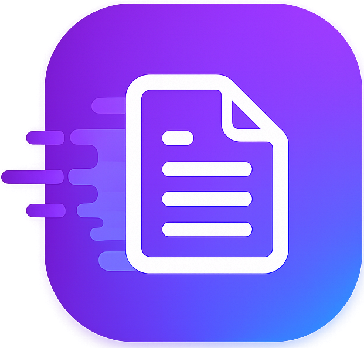
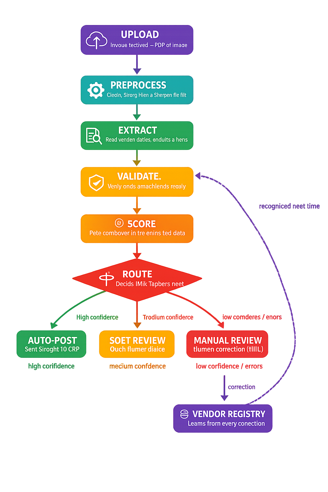
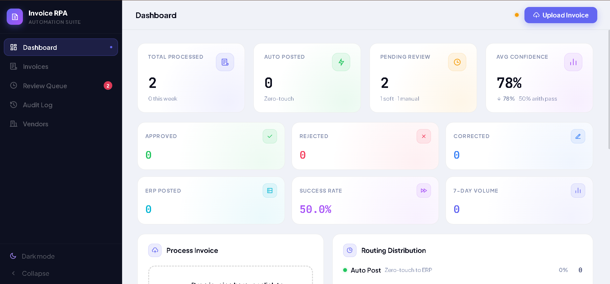
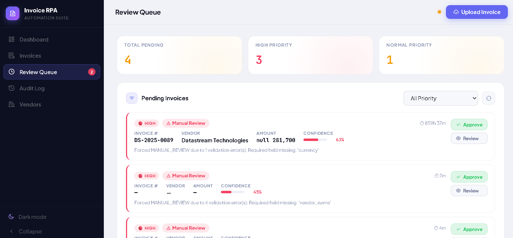

  

<h1 align="center">Invoice RPA — Intelligent Invoice Processing System</h1>

  <a href="https://invoice-rpa-pi.vercel.app/"><b>🔗 Live Demo</b></a>

An automated system that reads invoices, checks them for accuracy, and decides on its own whether an invoice can be posted directly, needs a quick check, or requires manual correction — removing repetitive manual invoice entry from the accounts payable workflow.

---

## The Problem

Manually processing invoices is slow, repetitive, and error-prone. Every invoice has to be opened, read, checked for correct totals, matched against a vendor, and then entered into the system by hand. As invoice volume grows, this becomes a bottleneck — mistakes slip through, review takes hours, and finance teams spend most of their time on data entry instead of actual decision-making.

## The Solution

Invoice RPA automates the entire journey of an invoice — from the moment it's uploaded to the moment it's ready for the accounting system. The system reads the invoice, verifies that the numbers add up, checks the vendor against a known registry, scores how confident it is in the extracted data, and then automatically routes the invoice:

- **High confidence** → posted straight through, no human involved
- **Medium confidence** → flagged for a quick review
- **Low confidence or errors** → sent to a human reviewer for correction

Every correction made by a human feeds back into the system, so vendors and patterns it has seen before are recognized faster next time.

## What Makes It Different

- **Decides for itself** — it doesn't just extract data, it judges how reliable that data is and acts accordingly, instead of dumping everything into a review queue.
- **Learns from corrections** — human fixes are not thrown away; they train the vendor registry so future invoices from the same vendor are trusted more.
- **Math-aware, not just text-aware** — it doesn't just read numbers, it checks whether they actually add up before trusting them.
- **Full transparency** — every action, decision, and confidence score is logged, so nothing is a black box.
- **One system, two views** — a processing engine underneath, and a clean human-review dashboard on top, working off the same data.

---

## How It Works

1. An invoice (PDF or image) is uploaded.
2. The system cleans and prepares the file for reading.
3. It extracts all key fields — vendor, dates, amounts, line items.
4. It validates the numbers and checks the vendor against its registry.
5. It scores its own confidence in the result.
6. Based on that score, it routes the invoice to the right destination — auto-post, soft review, or manual review.

---

## Dashboard

A quick look at how the system's activity, confidence, and routing decisions are surfaced to the user:

## Review Queue

Invoices that need a human decision land here, with the reason for review clearly stated:

---
